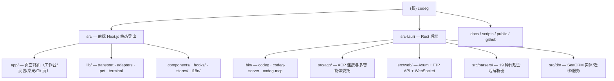

# CLAUDE.md

This file provides guidance to Claude Code (claude.ai/code) when working with code in this repository.

## 项目概述

Codeg（Code Generation）是一个多智能体编码工作台，它将多个智能体（Claude Code、Codex CLI、OpenCode、Gemini CLI、OpenClaw、Cline、Cursor、Kimi Code、Qoder、Grok、Hermes、Pi、CodeBuddy、DeepSeek Harness、Antigravity 等）统一到一个工作区中，支持会话聚合和多智能体协作，支持桌面安装，服务器/Docker 部署。当前版本 0.29.0。

## 技术栈

- **桌面运行时**: Tauri 2（Rust 后端 + webview 前端）
- **服务器运行时**: 独立 Rust 二进制（Axum HTTP + WebSocket）
- **前端**: Next.js 16（静态导出模式）+ React 19 + TypeScript（strict）
- **样式**: Tailwind CSS v4 + shadcn/ui（radix-maia 风格）
- **国际化**: next-intl（10 种语言）
- **数据库**: SeaORM + SQLite
- **包管理器**: pnpm（pnpm@11.9.0）

## 架构总览与模块索引



| 模块路径 | 语言 | 一句话职责 | 模块文档 |
|----------|------|-----------|----------|
| `src/` | TypeScript/React | Next.js 16 静态导出前端：会话工作台、设置、桌宠、Git 操作页，通过 Transport 抽象同时对接桌面与服务器模式 | [src/CLAUDE.md](./src/CLAUDE.md) |
| `src-tauri/` | Rust | 后端核心：代理会话文件解析（19 种 CLI）、ACP 连接管理、Axum HTTP/WS 服务、SeaORM+SQLite 持久化、MCP 委托伴生进程 | [src-tauri/CLAUDE.md](./src-tauri/CLAUDE.md) |
| `src-tauri/experts/`、`src-tauri/science/` | Markdown/TOML | 随应用打包的专家技能（skills）与科研技能资源（`include_dir` 内嵌） | — |
| `docs/`、`scripts/`、`.github/workflows/` | 文档/脚本 | 多语言 README、macOS 签名脚本、release/test CI | — |

## 架构

### 三种二进制（Cargo feature flags 区分）

- **`codeg`**（`tauri-runtime`，默认）：完整桌面应用，包含 Tauri 窗口管理、系统通知、自动更新、托盘图标、开机自启等
- **`codeg-server`**（无 feature，`--no-default-features`）：独立服务器模式，仅编译 Axum HTTP API + WebSocket。同一二进制支持附属模式：
  - `--version` / `-V`：打印版本退出
  - `--supervise`：作为进程监督者（Docker 中为 PID 1），负责 spawn worker 并在原地升级后重启（`supervise.rs`）
  - `--credential-helper`：作为 git credential helper 子进程响应凭据协议后退出（`git_credential.rs`）
- **`codeg-mcp`**（无 feature）：per-launch stdio MCP 伴生进程，被注入到代理 CLI 的 MCP 配置中，向 LLM 暴露**异步**子智能体委托工具：`delegate_to_agent`、`check_user_feedback`、`ask_user_question`、`get_session_info`，以及 chat-authoring 工具 `create_automation` / `create_work_task`；按 `--features` 分组（`delegation`/`feedback`/`ask`/`sessions`/`tasks`/`automations`/`taskboard`）开关。启动必需 `--parent-connection-id`、`--socket-path`、`--token` 三个参数。重量级逻辑在 `acp::delegation::{companion, transport}`，可经 UDS 单测。

### 共享核心

- **`app_state.rs`** — `AppState` 共享状态结构（db、连接管理器、终端管理器、事件广播器），两种模式通过 `EventEmitter` 枚举区分事件发射方式
- **`web/event_bridge.rs`** — `EventEmitter::Tauri(AppHandle)` 或 `EventEmitter::WebOnly(Arc<WebEventBroadcaster>)`
- **`web/router.rs`** — Axum 路由，接受 `Arc<AppState>`
- **`web/handlers/`** — 45 个 HTTP API 端点文件，全部使用 `Extension<Arc<AppState>>`

### Rust 后端（`src-tauri/src/`）

后端负责读取和解析本地文件系统上的代理会话文件，并承载应用全部业务逻辑：

- **`parsers/`** — 每个智能体一个解析器（19 个）：`claude`、`codex`、`codex_code_mode`、`gemini`、`opencode`、`openclaw`、`cline`、`cursor`、`kimi_code`、`qoder`、`grok`、`hermes`、`pi`、`codebuddy`、`deepseek`、`antigravity`、`acp_native` 等 + `summary_cache`
- **`acp/`** — Agent Client Protocol 连接管理（`manager`、`connection`、`event_stream`、`registry`、`session_state`、`plan_approval`、`question` 等）；子模块 **`acp/delegation/`** 实现多智能体异步委托（broker、companion、spawner、transport、UDS 通信、tool_schema.json）
- **`commands/`** — Tauri 命令层业务逻辑，`_core` 函数供两种模式共用；含子模块 `commands/backup/`（archive/crypto/restore/manifest，AES-GCM + Argon2 加密备份）
- **`web/`** — Axum HTTP API + WebSocket + 静态文件服务 + 认证中间件 + 压缩层 + 原地升级（`update/`、`socket_inherit`、`shutdown`）
- **`db/`** — SeaORM + SQLite：`entities/`（21 个实体）、`migration/`（按日期命名 `m2026MMDD_XXXXXX_*`）、`service/`（实体服务层）、`test_helpers.rs`
- **`models/`** — 共享数据结构（与前端 `src/lib/types.ts` 一一镜像）
- **`automation/`** — 定时自动化任务引擎（cron）
- **`chat_channel/`** — 聊天通道桥接，后端支持 `telegram` / `lark` / `weixin`（`backends/`），含调度器、命令分发、webhook、会话桥
- **`forge/`** — 代码托管平台集成（`github`、`gitlab`），含认证与交付
- **`work_task/` + `commands/work_task.rs`** — 工作任务看板（parked work）
- **`pets/`** — 桌宠资源与市场（`marketplace`、`codex_import`）；`pet_sessions.rs` / `pet_state_mapper.rs` 驱动桌宠状态
- **`backgrounds/`、`office_watch/`、`network/`、`terminal/`** — 后台任务、Office 文件监视、网络、PTY 终端（portable-pty）
- **`update/` + `supervise.rs`** — 原地自升级与进程监督
- **`git_repo.rs`、`git_credential.rs`、`folder_links.rs`、`workspace_transfer.rs`** — Git 仓库操作、凭据 helper、文件夹链接、工作区迁移

### 前端（`src/`）

#### 页面路由（`app/`）

- `/`（主工作台）、`/workspace`、`/login`
- `/settings/*` — 17 个设置子页（agents、appearance、chat-channels、experts、mcp、model-providers、science、skills、skill-packs、shortcuts、web-service、version-control 等）
- `/pet`、`/pet-panel` — 桌宠窗口与面板（`_components/`、`_hooks/` 私有目录）
- `/commit`、`/merge`、`/push`、`/stash`、`/import-sessions`、`/project-boot` — Git 与会话导入弹窗页

#### 核心库（`lib/`）

- **`transport/`** — Transport 抽象层，三种实现按环境自动切换：
  - `TauriTransport`（桌面：`invoke()`）
  - `WebTransport`（浏览器：`fetch()` + `web-event-stream`/`ws-auth` WebSocket）
  - `RemoteDesktopTransport`（远程桌面模式：Tauri 客户端绑定远端 codeg-server，API 调用与文件操作指向远端主机而非本地文件系统）
  - 关键 API：`getTransport()`、`getShellTransport()`、`isDesktop()`、`isRemoteDesktopMode()`、`configureRemoteDesktopTransport()`、`getServerBaseUrl()`
- **`adapters/`** — AI 响应到组件渲染的适配器（ai-elements-adapter、tool-kind-classifier 等）
- **`pet/`** — 桌宠前端（动画、sprite、市场资源代理）
- **`terminal/`** — 终端主题与写队列
- **`types.ts`** — Rust 模型的 TypeScript 镜像
- **`api.ts`** — 主 API 客户端；**`tauri.ts`** — Tauri API 封装

#### 其他分区

- **`components/`** — `ai-elements/`（消息渲染：markdown/mermaid/katex/file-tree/tool/reasoning）、`chat/`（输入框、权限/提问对话框、会话选择器）、`automations/`（自动化编辑器与模板）、`ui/`（shadcn 基础组件）
- **`hooks/`** — 连接生命周期（`use-connection`、`use-connection-lifecycle`）、委托子会话同步、IME 守卫等 60+ hooks
- **`stores/`** — Zustand store（tab-store、app-workspace-store、conversation-runtime-store 等）
- **`i18n/`** — next-intl，10 种语言消息在 `i18n/messages/*.json`

### 数据流

- 桌面模式：前端 `invoke()` → Tauri 命令 → 业务逻辑 → 返回数据
- 服务器模式：前端 `fetch()` → Axum HTTP API → 同一业务逻辑 → 返回 JSON
- 远程桌面模式：Tauri 客户端 `fetch()` → **远端** codeg-server（文件操作也指向远端）
- 实时通信：后端事件 → EventEmitter（Tauri 事件 / WebSocket 广播）→ 前端

### 条件编译约定

- `#[cfg(feature = "tauri-runtime")]` — 仅桌面模式编译（Tauri 窗口、通知、`tauri::State` 参数等）
- `#[cfg_attr(feature = "tauri-runtime", tauri::command)]` — 函数始终可用，仅在桌面模式标记为 Tauri 命令
- `#[cfg(feature = "test-utils")]` — 测试脚手架（`AppState::new_for_test` 等），release 构建物理不编译
- `_core` 后缀函数 — 接受普通引用参数（`&AppDatabase`、`&EventEmitter`），供 Web handlers 和 Tauri 命令共用

## 代码检查与测试（任务完成后进行必要的检查）

### 前端

```bash
pnpm eslint .                  # lint
pnpm test                      # vitest 全跑（CI 用同一条命令）
pnpm test:watch                # 开发时增量重跑
pnpm test:coverage             # 覆盖率报告（输出到 coverage/index.html）
pnpm build                     # 静态导出构建
```

### 后端 Rust（在 `src-tauri/` 目录下执行）

```bash
# 桌面模式（默认 feature）
cargo check
cargo test --features test-utils
cargo clippy --all-targets --features test-utils -- -D warnings

# 服务器模式
cargo check --no-default-features --bin codeg-server
cargo test --no-default-features --bin codeg-server --lib
cargo clippy --no-default-features --bin codeg-server --lib -- -D warnings

# codeg-mcp 协作伴生进程（多智能体委托）
cargo check --no-default-features --bin codeg-mcp
cargo clippy --no-default-features --bin codeg-mcp -- -D warnings

# 解析器快照评审（输出变化时）
cargo insta review
INSTA_UPDATE=auto cargo test --features test-utils     # 自动写新 .snap
```

## 测试策略

- **前端**：vitest + jsdom，`*.test.ts(x)` 与源文件同目录放置（`include: src/**/*.{test,spec}.{ts,tsx}`），setup 文件 `src/test-setup.ts`，coverage 用 v8 provider
- **Rust 单元测试**：`#[cfg(test)]` 内嵌于各模块；`test-utils` feature 提供测试脚手架
- **Rust 集成测试**：`src-tauri/tests/*.rs` 共 13 个（api_integration、backup_api、parsers_snapshot、delegation_e2e_uds、delegation_e2e_windows、ws_attach、codex_corpus_differential、sanity 等）
- **快照测试**：insta（JSON + redactions）用于解析器输出评审
- **CI**：`.github/workflows/test.yml`（前端 `pnpm test` + Rust 检查）、`release.yml`（多平台构建）

## 关键约束

- **仅支持静态导出**：`next.config.ts` 设置 `output: "export"`，不支持动态路由（`[param]`），必须使用查询参数替代
- **路径别名**：`@/*` 映射到 `./src/*`，导入写法为 `@/lib/utils`、`@/components/ui/button`
- **服务器部署**：通过环境变量配置（`CODEG_PORT`、`CODEG_HOST`、`CODEG_TOKEN`、`CODEG_DATA_DIR`、`CODEG_STATIC_DIR`）
- **Docker 支持**：多阶段构建（Node.js + Rust），`docker-compose.yml` 暴露 3080 端口、挂载 `codeg-data` 卷；容器内原地升级只存在于运行中的容器层，重建容器会回落到镜像版本
- **Tauri sidecar**：`src-tauri/binaries/` 由 `pnpm tauri:prepare-sidecars` 按平台生成，属 gitignore 的构建产物，通过 release.yml 分发
- **sacp-tokio 使用本地补丁**：`Cargo.toml` 的 `[patch.crates-io]` 将 `sacp-tokio` 指向 `vendor/sacp-tokio`

## 代码风格

- Prettier：无分号、尾逗号（es5）、2 空格缩进、80 字符宽度
- ESLint：next/core-web-vitals + typescript + prettier
- TypeScript：strict 模式，启用 `noUnusedLocals` 和 `noUnusedParameters`
- Rust：2021 edition，使用 `thiserror` 定义错误类型

## AI 使用指引

- 先读本文件了解全局，再按需进入 [src/CLAUDE.md](./src/CLAUDE.md)（前端）或 [src-tauri/CLAUDE.md](./src-tauri/CLAUDE.md)（后端）
- 前后端模型字段保持镜像：改 `src-tauri/src/models/` 时同步 `src/lib/types.ts`（反之亦然）
- 新增 DB 变更：在 `src-tauri/src/db/migration/` 按日期命名新建迁移，并补 entity + service
- 新增代理支持：在 `src-tauri/src/parsers/` 增加解析器并更新 `parsers/mod.rs`，快照测试走 insta
- 新增 HTTP 端点：`web/handlers/` 加 handler 并在 `web/router.rs` 注册；桌面等价命令放 `commands/`，共享逻辑提为 `_core` 函数
- AGENTS.md 与本文件为镜像文档（面向其他编码代理），更新本文件时考虑同步

## 变更记录 (Changelog)

- **2026-08-31 18:10:49 — 初始化架构师增量扫描**：保留原有有效内容；补入 remote-desktop transport（第三传输模式）、codeg-server 附属模式（`--version`/`--supervise`/`--credential-helper`）、codeg-mcp 工具清单与启动参数、后端新模块（automation、chat_channel、forge、pets、work_task、backgrounds、office_watch、update/supervise、commands/backup）、19 个会话解析器清单、前端路由与组件分区、Docker 升级语义与 sidecar 约束；新增架构总览 Mermaid 图、模块索引表、测试策略与 AI 使用指引；生成 `src/CLAUDE.md` 与 `src-tauri/CLAUDE.md` 模块文档。
- **2026-08-31 18:50 — 模块级补扫**：`src-tauri/CLAUDE.md` 补入 experts/science 技能包结构（14+13 技能、experts.toml 注册表约定）、HTTP API 端点概览（348 条路由实测、/api 前缀、按域分布）、sidecar 准备脚本机制；`src/CLAUDE.md` 补入 components/ 全部 32 分区实测规模（settings 88 / message 83 / layout 62 / chat 52 / tasks 38）。
