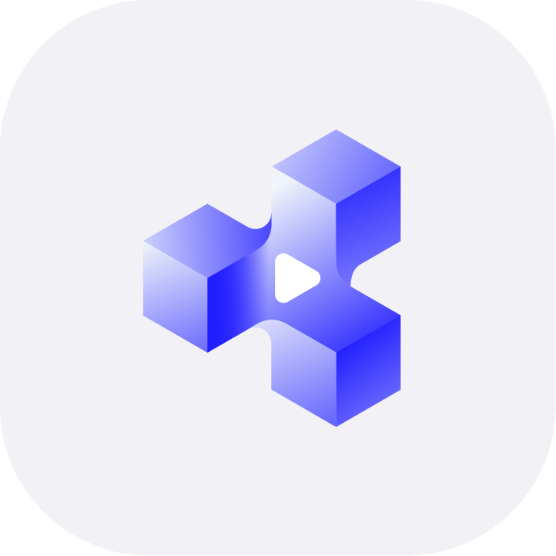
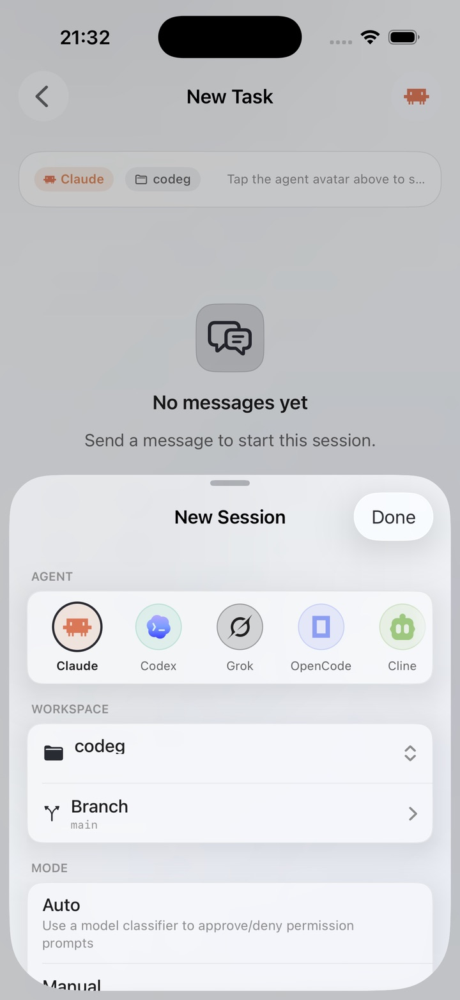
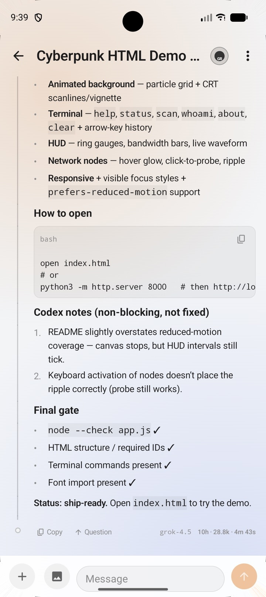

# Codeg

[](https://github.com/xintaofei/codeg/releases)
[](https://docs.codeg.app)
[](../../LICENSE)

<p>
  <a href="../../README.md">English</a> |
  <a href="./README.zh-CN.md">简体中文</a> |
  <a href="./README.zh-TW.md">繁體中文</a> |
  <a href="./README.ja.md">日本語</a> |
  <strong>한국어</strong> |
  <a href="./README.es.md">Español</a> |
  <a href="./README.de.md">Deutsch</a> |
  <a href="./README.fr.md">Français</a> |
  <a href="./README.pt.md">Português</a> |
  <a href="./README.ar.md">العربية</a>
</p>

Codeg(Code Generation)는 멀티 에이전트 코딩 워크스페이스입니다. 모든 AI 코딩 에이전트를 한곳에서 실행하고, 서로 협업하게 만듭니다.

지원되는 모든 에이전트 CLI의 세션을 검색 가능한 하나의 워크스페이스로 모으고, 하나의 작업 안에서 메인 에이전트가 다른 종류의 서브 에이전트에게 위임할 수 있으며, 데스크톱 앱·독립 서버·Docker 컨테이너 어느 형태로든 실행됩니다. 또한 네이티브 iOS·Android 클라이언트가 있어 자리를 비운 사이에도 작업을 이어갈 수 있습니다.


## 📖 문서

**전체 문서는 [docs.codeg.app](https://docs.codeg.app)** — [시작하기](https://docs.codeg.app/getting-started/) · [가이드](https://docs.codeg.app/guide/) · [레퍼런스](https://docs.codeg.app/reference/)

## 💖 스폰서

<table>
  <tr>
    <td align="center" width="220">
      <a href="https://www.compshare.cn/?ytag=GPU_YY_git_codeg" target="_blank"></a><br/>
      <strong><a href="https://www.compshare.cn/?ytag=GPU_YY_git_codeg">Compshare(UCloud)</a></strong>
    </td>
    <td>본 프로젝트를 후원해 주신 Compshare에 감사드립니다! Compshare는 UCloud 산하의 AI 클라우드 플랫폼으로, 월정액·종량제 방식의 가성비 높은 국내 모델 agent Plan 요금제를 월 49위안부터 제공합니다. 또한 안정적인 공식 프록시 방식의 해외 모델 접근도 지원합니다. Claude Code, Codex 및 API 연동을 지원하며, 기업 환경의 높은 동시성, 7×24 기술 지원, 셀프 인보이스 발급도 지원합니다. <a href="https://www.compshare.cn/?ytag=GPU_YY_git_codeg">이 링크</a>를 통해 가입하시면 무료 5위안 플랫폼 체험 크레딧을 받으실 수 있습니다!</td>
  </tr>
  <tr>
    <td align="center" width="220">
      <a href="https://sui-xiang.com/register?aff=JPFCRHHBE8HE" target="_blank"></a><br/>
      <strong><a href="https://sui-xiang.com/register?aff=JPFCRHHBE8HE">随想AI中转站</a></strong>
    </td>
    <td>본 프로젝트를 후원해 주신 随想AI中转站에 감사드립니다! 随想AI中转站는 Claude, Codex, Gemini 등의 중계 서비스를 제공하는 신뢰할 수 있고 효율적인 API 중계 서비스 제공업체입니다. 신규 계정은 <a href="https://sui-xiang.com/register?aff=JPFCRHHBE8HE">가입</a> 후 매일 출석 체크만 해도 0.5위안의 테스트 크레딧을 받을 수 있으며, 충전 금액은 1:1로 적립되고 구독 없이 사용한 만큼만 결제합니다. 다중 회선 이중화, 리전 간 재해 복구, 자동 장애 조치로 장시간 SSE 연결이 끊기지 않습니다.</td>
  </tr>
  <tr>
    <td align="center" width="220">
      <a href="https://hezu.ink/sign-up?aff=0wVz" target="_blank"></a><br/>
      <strong><a href="https://hezu.ink/sign-up?aff=0wVz">合租巴士</a></strong>
    </td>
    <td>본 프로젝트를 후원해 주신 合租巴士에 감사드립니다! 合租巴士는 Codex, Claude Code 등 주요 모델에 대한 높은 안정성의 중계 기능을 제공하는 신뢰할 수 있고 효율적인 AI 중계 서비스 플랫폼입니다. 충전 비율이 투명하며(1:1), Codex 요율 보조는 최저 0.08까지 제공됩니다. <a href="https://hezu.ink/sign-up?aff=0wVz">공식 웹사이트에서 그룹에 참여하면 $5 체험 크레딧을 받을 수 있습니다</a>.</td>
  </tr>
  <tr>
    <td align="center" width="220">
      <a href="https://onehop.ai/platform/login?ref=CODEG&utm_source=github&utm_medium=readme_sponsor&utm_campaign=codeg&utm_content=sponsor_cta" target="_blank"></a><br/>
      <strong><a href="https://onehop.ai/platform/login?ref=CODEG&utm_source=github&utm_medium=readme_sponsor&utm_campaign=codeg&utm_content=sponsor_cta">OneHop</a></strong>
    </td>
    <td>본 프로젝트를 후원해 주신 OneHop에 감사드립니다! OneHop를 사용하면 Codeg 사용자는 OpenAI 호환 API 키 하나로 GPT, Claude, Gemini, DeepSeek, Kimi, Qwen을 비롯한 수백 개의 주요 모델을 이용할 수 있습니다. 여러 공급업체 계정을 관리하거나 코드를 반복해서 수정하지 않고도 모델을 전환할 수 있으며, 사용한 만큼만 지불합니다. <a href="https://onehop.ai/platform/login?ref=CODEG&utm_source=github&utm_medium=readme_sponsor&utm_campaign=codeg&utm_content=sponsor_cta">Codeg를 통해 가입</a>하면 $1 크레딧을 받고, 여기에 OneHop 커뮤니티에 참여하여 웰컴 이벤트에 참여하면 추가로 $5——최대 총 $6의 테스트 크레딧을 받을 수 있습니다.</td>
  </tr>
</table>

> Codeg의 스폰서가 되고 싶으신가요? [이메일로 문의해 주세요.](mailto:itpkcn@gmail.com)

## 🤖 지원 에이전트

Claude Code · Codex · Gemini · OpenClaw · OpenCode · Cline · Hermes · CodeBuddy · Kimi Code · Pi · Grok · Cursor

이 중 대부분은 Codeg가 대신 설치하고, 버전을 고정하고, 업데이트합니다. 전체 목록과 각 에이전트의 실행 환경 요구 사항, 세션이 디스크에 저장되는 위치는 [지원 에이전트](https://docs.codeg.app/guide/supported-agents)를 참고하세요.

## 🤝 멀티 에이전트 협업

멀티 에이전트 협업이 키 하나로 끝납니다. `@`를 입력하고, 에이전트를 고르고, 보내기만 하면 됩니다. 나머지 스케줄링은 Codeg가 맡습니다 — 언급된 에이전트를 각각 독립 세션으로 실행하고, 작업을 넘기고, 그 결과를 지금 보고 있는 스레드로 다시 흘려보냅니다. 둘을 언급하면 나란히 진행됩니다. Claude Code가 초안을 쓰는 동안 Codex가 검토하는 식으로요. 컨텍스트 전환도, 터미널 사이를 오가는 복사·붙여넣기도 없습니다.


## 📄 Office 문서

덱이든 보고서든 워크북이든, 요청하면 에이전트가 진짜 `.pptx` / `.docx` / `.xlsx` 파일을 만듭니다 — 오른쪽 패널이 그것을 실시간으로 렌더링하는 동안에요. 수정은 알아서 미리보기에 반영됩니다. 슬라이드가 채워지고, 표가 자리를 잡고, 숫자가 셀에 들어갑니다. 4번 슬라이드가 마음에 들지 않나요? 다음 메시지로 말하면 됩니다 — 에이전트가 같은 파일을 그 자리에서 고치고, 미리보기가 따라옵니다. 내보내기도, 외부 Office 앱도, Codeg를 벗어날 일도 없습니다.


## 💻 워크스페이스

워크스페이스는 하나, 에이전트는 전부. 무엇이 일하고 있든 — Claude Code든 Codex든 Cursor든 — 같은 에디터, 같은 실시간 diff, 같은 Git 클라이언트 안에서 움직입니다. 그리고 만들어지는 것은 저장소 안의 진짜 파일이며, 보는 앞에서 바뀝니다.

**세션.** 이미 가진 기록을 그대로 가져오세요. 설치된 모든 에이전트의 지난 세션을 클릭 한 번으로 불러오고, 멈춘 지점부터 이어갑니다. 들어온 뒤로는 서로 단절된 섬이 아닙니다 — 예전 세션을 `@`로 언급하면 지금 대화 중인 에이전트가 그것을 읽습니다. 다른 에이전트가 남긴 것이어도 마찬가지라, 오늘의 Codex가 지난주 Claude Code가 끝낸 지점에서 이어갑니다.

**파일.** 에이전트의 수정은 반영되는 즉시 대화 옆에 diff로 나타납니다. 어떤 파일이든 구문 강조가 되는 진짜 에디터에서 열고, `⌘L`로 파일 전체나 선택한 부분만 에이전트에게 바로 넘기고, Markdown·HTML·이미지·Office 문서를 같은 패널에서 미리 봅니다.

**Git.** 상태 표시가 아니라 완전한 클라이언트입니다. 커밋과 푸시, 커밋별 푸시 상태가 보이는 히스토리, 브랜치·머지·리베이스·스태시·리셋, 다른 브랜치와의 비교까지. 충돌은 3분할 머지 에디터로 열려 헝크 단위로 받아들이거나 직접 고쳐 씁니다. 그리고 워크트리는 병렬 작업을 한 번의 동작으로 만듭니다 — 새 브랜치, 전용 디렉터리, 그리고 그 안에 뿌리내린 새 대화. 여러 에이전트가 서로의 파일을 건드리지 않고 서로 다른 기능을 동시에 만듭니다.

## 📱 iPhone, iPad & Android

책상을 떠나도 작업은 멈추지 않습니다. 네이티브 iOS·Android 클라이언트는 이미 돌아가고 있는 당신의 Codeg —— 데스크톱 앱의 **웹 서비스**, 또는 직접 운영하는 `codeg-server` —— 에 연결됩니다. 거기서 세션을 시작하고, 응답과 도구 호출이 실시간으로 흘러드는 것을 지켜보고, 권한 요청에 답하고, 프로젝트와 브랜치를 둘러볼 수 있습니다. 휴대폰으로 옮겨지는 것은 없습니다. 파일과 에이전트 CLI, 대화는 Codeg가 도는 컴퓨터에 그대로 남고, 액세스 토큰은 iOS 키체인이나 Android 키스토어가 보관합니다. 두 클라이언트 모두 오픈 소스이며([iOS](https://github.com/xintaofei/codeg-ios), [Android](https://github.com/xintaofei/codeg-android)) 현재는 테스트 릴리스입니다. 연결은 세 단계면 끝나며, 자세한 내용은 [모바일 앱](https://docs.codeg.app/getting-started/installation#mobile-apps)에 있습니다.

| iPhone & iPad | Android |
| :---: | :---: |
|  |  |

## ✨ 하이라이트

- **[대화 통합](https://docs.codeg.app/guide/aggregation)** — 지원되는 모든 에이전트의 세션을 검색 가능한 하나의 워크스페이스로 가져오고, 멈춘 지점부터 이어서 진행합니다
- **[멀티 에이전트 협업](https://docs.codeg.app/guide/multi-agent)** — `@`로 에이전트를 언급하면 곧 위임입니다. 서로 다른 종류의 서브 에이전트가 각자 독립 세션으로, 하나의 작업 안에서 병렬로 실행됩니다
- **[워크스페이스](https://docs.codeg.app/guide/workspace)** — 에이전트 옆에 개발의 전 과정이 있습니다: 파일 트리, 에디터와 diff, Git 변경 사항, 커밋, 내장 터미널
- **[Git과 Worktree](https://docs.codeg.app/guide/git)** — 변경 사항 검토와 커밋, Git 원격 계정 관리, 내장 `git worktree` 흐름을 이용한 병렬 작업
- **[채팅 채널](https://docs.codeg.app/guide/chat-channels)** — Telegram, Lark(Feishu), iLink(Weixin)에서 에이전트를 조작합니다: 작업 생성, 권한 승인, 실시간 진행 상황 수신
- **[자동화](https://docs.codeg.app/guide/automations)** — 설정을 마친 입력창을 재사용 가능한 자동화로 저장해 cron 일정이나 필요할 때 헤드리스로 실행합니다
- **[Office 문서](https://docs.codeg.app/guide/office)** — 내장 `officecli`로 `.docx` / `.xlsx` / `.pptx`를 만들고 분석·교정·편집하며, 탭 안에서 실시간 미리보기를 제공합니다
- **[과학 연구](https://docs.codeg.app/guide/research)** — 내장 연구 스킬(가설 생성, 실험 설계, 통계, 시각화, 비판적 평가, 문헌 검색)을 어떤 에이전트에서든 호출할 수 있습니다
- **[프로젝트 부트](https://docs.codeg.app/guide/project-boot)** — 실시간 미리보기와 함께 새 프로젝트를 시각적으로 구성하고, 곧바로 워크스페이스에서 엽니다
- **[MCP](https://docs.codeg.app/guide/mcp) & [스킬](https://docs.codeg.app/guide/skills)** — 로컬 서버 스캔과 레지스트리 검색/설치, 스킬은 전역 또는 프로젝트 범위로 관리
- **[데스크톱·서버·Docker](https://docs.codeg.app/getting-started/deployment)** — 네이티브 데스크톱 앱, 브라우저로 접속하는 독립 실행형 `codeg-server`, 또는 `docker compose up`
- **[iPhone, iPad & Android](https://docs.codeg.app/getting-started/installation#mobile-apps)** — 데스크톱이나 서버에 연결되는 네이티브 모바일 클라이언트: 어디서나 세션을 시작하고, 응답을 스트리밍으로 받고, 권한을 승인하고, 프로젝트를 살펴봅니다

## 📦 설치 및 실행

**데스크톱** — [Releases](https://github.com/xintaofei/codeg/releases)에서 macOS, Windows, Linux용 설치 프로그램을 내려받은 뒤 [설치](https://docs.codeg.app/getting-started/installation) 안내를 따르세요.

**서버** — Codeg를 헤드리스로 실행하고 어떤 브라우저에서든 접속합니다. Linux 또는 macOS:

```bash
curl -fsSL https://raw.githubusercontent.com/xintaofei/codeg/main/install.sh | bash
CODEG_STATIC_DIR=/usr/local/share/codeg/web codeg-server
```

Windows(PowerShell):

```powershell
irm https://raw.githubusercontent.com/xintaofei/codeg/main/install.ps1 | iex
$env:CODEG_STATIC_DIR="$env:LOCALAPPDATA\codeg\web"; codeg-server
```

**Docker** — 같은 서버를, 컨테이너 하나로:

```bash
docker run -d -p 3080:3080 -v codeg-data:/data ghcr.io/xintaofei/codeg:latest
```

**모바일** — [iOS 앱](https://apps.apple.com/app/codeg-client/id6785199071) 또는 [Android APK](https://github.com/xintaofei/codeg-android/releases/latest)를 설치한 뒤 데스크톱 앱의 **웹 서비스**나 직접 운영하는 `codeg-server`를 가리키게 하세요: 주소와 토큰만 넣으면 끝입니다. 연결 절차는 [모바일 앱](https://docs.codeg.app/getting-started/installation#mobile-apps) 참고.

Compose, 사전 빌드 바이너리, 소스 빌드, 무중단 업데이트는 [배포](https://docs.codeg.app/getting-started/deployment)에서, 환경 변수는 [설정](https://docs.codeg.app/getting-started/configuration)에서 다룹니다. Codeg 자체를 빌드하려면 [개발](https://docs.codeg.app/reference/development)과 [아키텍처](https://docs.codeg.app/reference/architecture)를 보세요.

## 🔒 개인정보 보호 및 보안

- 파싱·저장·프로젝트 작업은 기본적으로 로컬 우선 — 네트워크 접근은 사용자가 시작한 동작에서만 발생합니다
- 웹 모드와 서버 모드는 토큰 기반 인증으로 보호됩니다
- 기업 환경을 위한 시스템 프록시 지원

자세한 내용은 [개인정보 보호 및 보안](https://docs.codeg.app/reference/privacy)을 참고하세요.

## 👥 커뮤니티

- 아래 QR 코드를 스캔하여 토론, 피드백, 업데이트를 위한 WeChat 그룹에 참여하세요


- [LinuxDO](https://linux.do) 커뮤니티의 지원에 감사드립니다

## 🙏 감사의 말

- [Agent Client Protocol](https://agentclientprotocol.com) — Codeg가 지원하는 모든 에이전트에 연결할 수 있게 해주는 토대
- [Superpowers](https://github.com/obra/superpowers) — Codeg의 전문가 스킬 모듈을 지원하는 프로젝트
- [OfficeCLI](https://github.com/iOfficeAI/OfficeCLI) — Codeg의 Office 문서 워크플로우를 지원하는 프로젝트
- [scientific-agent-skills](https://github.com/K-Dense-AI/scientific-agent-skills) — Codeg의 과학 연구 스킬을 지원하는 프로젝트 (MIT 라이선스 서브셋)

## 📜 라이선스

Apache-2.0. [LICENSE](../../LICENSE)를 참고하세요.
