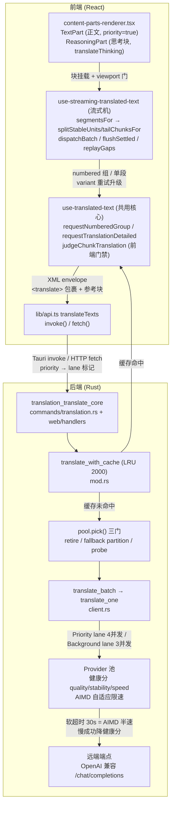
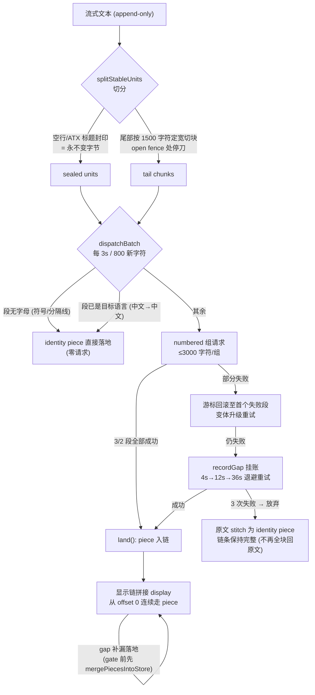
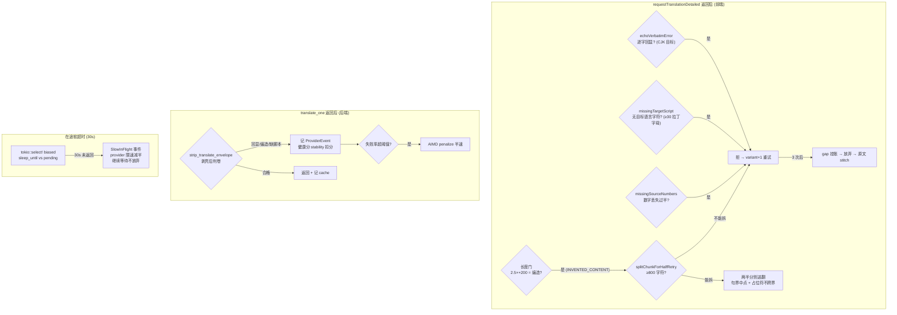
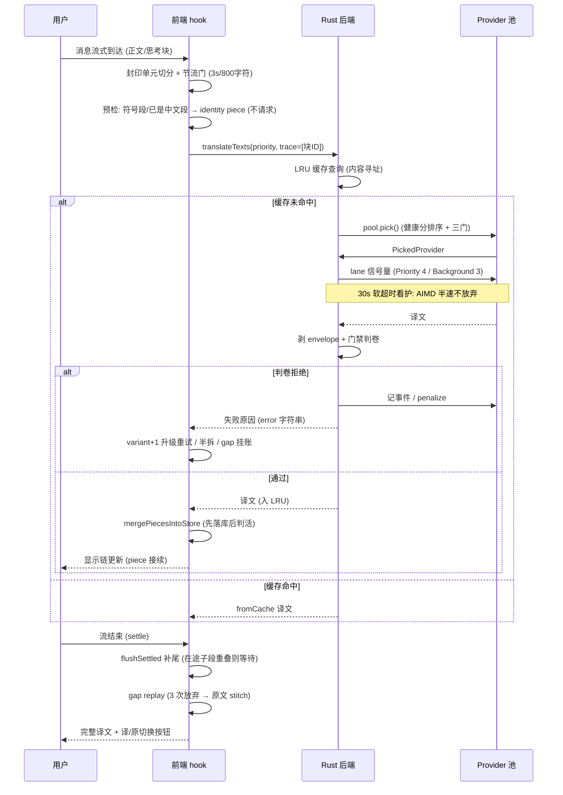

# 翻译功能调用过程图

> 依据 `feat/translation-middleware` 分支实际代码绘制（2026-09-07）。

## 1. 端到端调用链

## 2. 流式分段与显示链（正文/思考块共用）

## 3. 质量门禁与重试升级

## 4. 一条正文的完整生命周期（时序）

## 关键文件对照

| 环节 | 文件 |
|---|---|
| 分段/门禁/重试判据 | `src/lib/translation.ts` |
| 流式翻译机 (dispatch/flush/replay) | `src/hooks/use-streaming-translated-text.ts` |
| 请求构造/判卷/缓存键 | `src/hooks/use-translated-text.ts` |
| Provider 池/健康分/AIMD | `src-tauri/src/translation/pool.rs`, `health.rs` |
| 请求执行/软超时/lane | `src-tauri/src/translation/client.rs` |
| 缓存与后端门禁 | `src-tauri/src/translation/mod.rs` |
